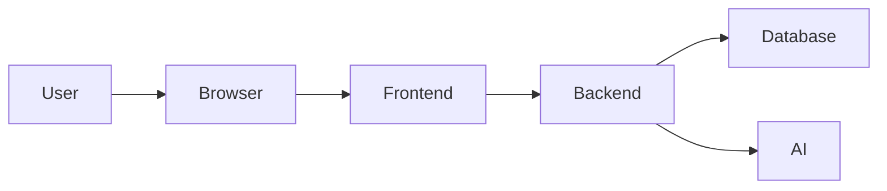
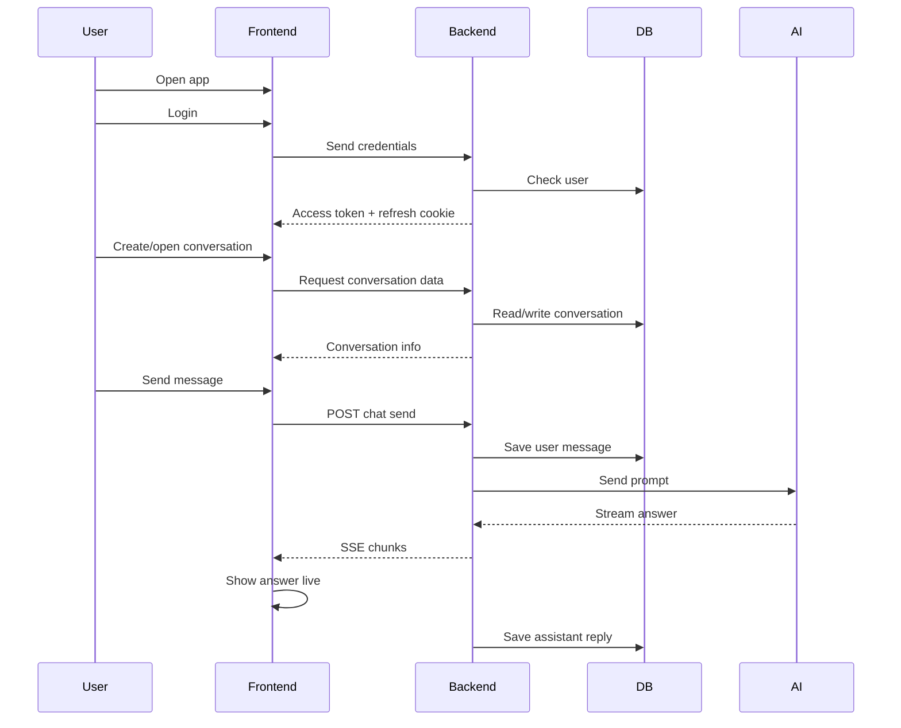

# Beginner Project Walkthrough

## Start from the very beginning

Think of this project like a **website with a brain**.

- The **website UI** is the frontend
- The **brain and logic** are the backend
- The **memory** is the database
- The **AI model** is an external service the backend talks to

So the app lets a user:

1. open the website
2. log in
3. start a chat
4. send a message
5. get an AI response
6. save the conversation for later

---

# 1. What this project is

This is an **AI chat platform**.

Main features from `docs/overview/repository-overview.md`:

- authentication
- saved conversations
- AI chat responses
- admin pages
- optional web search
- optional RAG knowledge base

Simple meaning:

- normal users chat with AI
- admins manage models, users, prompts, and documents

---

# 2. The 4 main pieces

## A. Frontend
Folder: `frontend/`

This is what the user sees in the browser.

It includes:

- pages
- buttons
- forms
- chat screen
- admin screen

Built with:

- Next.js
- React
- TypeScript
- Tailwind

---

## B. Backend
Folder: `backend/`

This is the server.

It handles:

- login
- checking tokens
- saving data
- calling the AI provider
- streaming responses
- admin actions

Built with:

- FastAPI
- SQLAlchemy
- Alembic

---

## C. Database
Used by backend.

Stores:

- users
- conversations
- messages
- model settings
- refresh tokens
- RAG documents

This project uses PostgreSQL.

---

## D. AI provider
External service.

The backend sends prompts to it and gets AI responses back.

Configured through:

- `backend/config/api_keys.yaml`

---

# 3. How a web app works in general

A beginner-friendly model:

### Meaning
- **User** clicks buttons and types text
- **Frontend** shows screens and sends requests
- **Backend** does the real work
- **Database** stores information
- **AI** generates answers

---

# 4. What happens when the app starts

## Frontend start
The frontend app runs from `frontend/`.

Its package file is `frontend/package.json`.

Important scripts:

- `npm run dev`
- `npm run build`
- `npm run start`

So the frontend is a Next.js app.

## Backend start
The backend entry is:

- `backend/app/main.py`

That file creates the FastAPI app and registers routes.

---

# 5. Backend entry point

In `backend/app/main.py`:

- FastAPI app is created
- CORS middleware is added
- routers are included

Routers:

- `auth`
- `conversations`
- `chat`
- `models`
- `admin`
- `admin_rag`
- `health`

This means the backend is split into small route files by feature.

---

# 6. What is a route

A **route** is an API URL.

Example:

- `POST /api/auth/login`
- `GET /api/conversations`
- `POST /api/chat/{id}/send`

A route is like a door into the backend.

Each door does one job.

---

# 7. Frontend and backend relationship

The frontend does not directly talk to the database or AI.

It talks to the backend only.

So:

- frontend = asks for things
- backend = decides what to do
- backend = talks to DB and AI

This is important.

---

# 8. Authentication first

Before chatting, user usually logs in.

## Backend auth routes
In `backend/app/routers/auth.py`:

- login
- register
- logout
- me
- refresh

## Frontend auth logic
In `frontend/hooks/useAuth.ts`:

- `login()`
- `register()`
- `refresh()`
- `fetchMe()`
- `logout()`

So frontend calls backend auth endpoints.

---

# 9. What happens during login

Step by step:

1. user enters email and password
2. frontend sends them to backend
3. backend checks if user exists
4. backend checks password
5. backend creates tokens
6. frontend becomes logged in

In backend:

- `authenticate_user()` in `backend/app/services/auth_service.py`

---

# 10. Tokens in simple words

This project uses 2 tokens.

## Access token
Short-lived token used for API requests.

## Refresh token
Longer-lived token used to get a new access token.

In this project:

- access token is stored client-side
- refresh token is stored in an `httpOnly` cookie

This is described in docs and implemented in `backend/app/routers/auth.py`.

---

# 11. Why refresh token exists

Because access tokens expire.

Instead of forcing login again immediately, frontend can ask backend:

- “please give me a new access token”

That happens through:

- `POST /auth/refresh`

In `frontend/lib/api.ts`, Axios automatically tries refresh on `401`.

So the user experience is smoother.

---

# 12. Frontend auth storage

In `frontend/store/authStore.ts`:

- access token
- user info

are stored in Zustand.

Zustand is a small state manager.

Think of it as a shared memory box for the frontend.

---

# 13. Route protection

In `frontend/middleware.ts`:

- if not logged in, `/chat` and `/admin` redirect to `/login`
- if not admin, `/admin` redirects to `/chat`

So users cannot open protected pages directly.

---

# 14. After login: conversations

Once logged in, user can create or open conversations.

Backend file:

- `backend/app/routers/conversations.py`

This file handles:

- list conversations
- create conversation
- get one conversation
- update conversation
- delete conversation
- summarize title

A conversation is one chat thread.

---

# 15. What is stored in a conversation

A conversation has:

- id
- title
- user owner
- model id
- timestamps

Messages belong to the conversation.

So:

- conversation = container
- messages = items inside it

---

# 16. Frontend conversation logic

In `frontend/hooks/useConversations.ts`:

- `loadConversations()`
- `createConversation()`
- `deleteConversation()`
- `summarizeConversationTitle()`

This hook talks to backend and updates the chat store.

---

# 17. Chat is the main feature

The most important part is sending a message and getting an AI reply.

Frontend file:

- `frontend/hooks/useChat.ts`

Backend file:

- `backend/app/routers/chat.py`

Service file:

- `backend/app/services/chat_service.py`

These 3 are the core chat path.

---

# 18. What happens when user sends a message

Very simple version:

1. user types message
2. frontend sends it to backend
3. backend saves it
4. backend builds prompt
5. backend calls AI provider
6. backend streams answer back
7. frontend shows answer live
8. backend saves assistant reply

That is the heart of the app.

---

# 19. Frontend send flow

In `frontend/hooks/useChat.ts`:

When `sendMessage()` runs:

- it adds the user message immediately
- it adds a temporary assistant message like “Thinking...”
- it sends request to backend
- it reads stream events
- it updates the assistant message live

This is called **optimistic UI**.

Meaning:
the UI updates before the full backend work finishes.

---

# 20. Backend send flow

In `backend/app/routers/chat.py`:

When `/chat/{conversationId}/send` is called:

- verify user owns conversation
- find active model
- optionally do search
- optionally do RAG retrieval
- save user message
- load message history
- add system prompt/context
- stream AI response
- save assistant message

So the backend is doing much more than just “send text to AI”.

---

# 21. What is a prompt here

A prompt is the input sent to the AI model.

It is not only the latest user message.

It may include:

- global system prompt
- previous messages
- search results
- RAG context
- latest user message

This is built in `backend/app/services/chat_service.py`.

---

# 22. Global system prompt

The app has a global instruction for the AI.

In `chat_service.py`:

- `get_global_system_prompt()`

This prompt tells the assistant how to behave.

Example ideas:

- be concise
- be accurate
- use search carefully
- avoid guessing

Admins can manage this.

---

# 23. Search augmentation

If user enables search:

- backend runs web search
- results are saved
- results are inserted into prompt as context

So the AI can answer using fresh web information.

This is handled from `backend/app/routers/chat.py` and prompt helpers in `chat_service.py`.

---

# 24. RAG augmentation

RAG means the app can search uploaded documents.

If enabled:

- backend retrieves relevant chunks from stored documents
- adds them to prompt
- sends citations to frontend

So the AI can answer using internal knowledge, not only general model knowledge.

---

# 25. What is SSE

The backend does not wait for the full answer before replying.

It streams the answer piece by piece.

This uses **SSE**.

In `backend/app/routers/chat.py`:

- `StreamingResponse(..., media_type="text/event-stream")`

In `frontend/lib/stream.ts`:

- stream chunks are parsed

In `frontend/hooks/useChat.ts`:

- each chunk updates the assistant message

So the user sees text appear live.

---

# 26. Why streaming is useful

Without streaming:

- user waits 5–20 seconds and sees nothing

With streaming:

- user sees the answer start immediately

This feels faster and more natural for chat apps.

---

# 27. How the backend talks to AI

In `backend/app/services/chat_service.py`:

- provider config is loaded
- messages are trimmed to token budget
- request is sent to OpenAI-compatible API

Supported path includes:

- Azure OpenAI
- OpenAI-compatible provider

So this file is the AI integration layer.

---

# 28. Why message history matters

If only the latest message were sent, the AI would forget earlier context.

This project loads full conversation history from the database and sends it with the new message.

That is why old conversations still make sense.

---

# 29. Database role

The database is the app’s memory.

It stores:

- who users are
- what conversations exist
- what messages were sent
- what models are active
- what documents were uploaded

Without the database, every refresh would lose everything.

---

# 30. Models and migrations

Database tables are represented by model files in:

- `backend/app/models/`

Schema changes are tracked by Alembic in:

- `backend/alembic/versions/`

So:

- models = Python representation of tables
- migrations = version history of schema changes

---

# 31. Admin features

Admins can manage the platform.

From docs, admin features include:

- users
- models
- global prompt
- usage logs
- RAG documents

Backend:

- `backend/app/routers/admin.py`
- `backend/app/routers/admin_rag.py`

Frontend:

- `frontend/app/admin/`

---

# 32. Model configuration

The app needs at least one active model.

When chat runs, backend tries to find:

- conversation model
- otherwise first active model

If no model exists, chat cannot work.

That is why model seeding/config matters.

---

# 33. Error handling

The app handles common failures:

- bad login
- expired token
- missing conversation
- no active model
- provider failure
- search failure
- RAG failure

The backend tries to return readable errors instead of raw crashes.

---

# 34. Deployment idea

For local development:

- frontend and backend run separately

For production-like deployment:

- systemd runs services
- nginx sits in front

Files:

- `infra/systemd/`
- `infra/nginx/`

---

# 35. The simplest full story

Here is the whole app in one beginner story:

---

# 36. Best beginner way to study this project

Read in this order:

1. `docs/overview/repository-overview.md`
2. `backend/app/main.py`
3. `backend/app/routers/auth.py`
4. `backend/app/routers/conversations.py`
5. `backend/app/routers/chat.py`
6. `backend/app/services/chat_service.py`
7. `frontend/lib/api.ts`
8. `frontend/hooks/useAuth.ts`
9. `frontend/hooks/useConversations.ts`
10. `frontend/hooks/useChat.ts`
11. `frontend/store/authStore.ts`
12. `frontend/store/chatStore.ts`
13. `frontend/middleware.ts`

---

# 37. One-line summary

> This project is a full-stack AI chat app where the frontend handles the UI, the backend handles auth/chat/business logic, the database stores everything, and the AI provider generates responses that are streamed back live.
